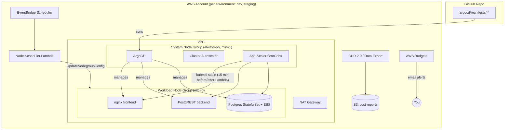

# Auto Scale-to-Zero Dev/Staging EKS Platform

A production-shaped AWS EKS platform for dev/staging Kubernetes environments that automatically scales its compute to zero outside business hours, and back up in time for the next workday — with GitOps-managed workloads, real Cost and Usage Report data proving the savings, and every piece of it defined in Terraform.

## Problem

Dev and staging Kubernetes clusters are typically run 24/7, even though they're only actually used during business hours on weekdays (~45 of the week's 168 hours). That means roughly **70% of the compute behind a "dev" environment is idle** — nights, weekends, and holidays — while still being billed at full price. This project eliminates that waste without asking engineers to remember to turn anything on or off.

## Solution

- **EKS control plane + two node groups per environment.** A small, fixed-size, always-on system node group runs ArgoCD and Cluster Autoscaler. A workload node group (`min=0`) runs the actual application and scales to zero every night.
- **A serverless scheduler, not a cron-job hack.** An EventBridge Scheduler + Lambda function directly sets the workload node group's desired capacity on a schedule — deterministic and fully Terraform-managed, no third-party "instance scheduler" solution bolted on.
- **A Kubernetes-native companion scheduler that prevents Cluster Autoscaler from fighting the Lambda.** A RBAC-scoped CronJob scales the application's replicas to zero *before* the node group is zeroed (and back up *after* it's restored) — without this, Cluster Autoscaler would see the app's still-Pending pods and immediately re-provision nodes the Lambda just removed.
- **GitOps via ArgoCD's App-of-Apps pattern**, with sync-wave ordering (database → backend → frontend) and an explicit `ignoreDifferences` exemption so Argo's self-heal doesn't fight the scaling CronJobs.
- **A real, if small, multi-tier demo app** — nginx frontend → PostgREST backend → Postgres (StatefulSet + EBS) — chosen so the whole stack, including the data tier, genuinely scales to zero and back with data intact.
- **Cost proven, not claimed.** AWS Budgets, Cost and Usage Report 2.0 (Data Exports), and cost allocation tags are all Terraform-managed, plus a script that pulls real Cost Explorer numbers into a before/after comparison.

## Architecture



**Why these choices** (full reasoning in commit history / prior design discussion, summarized here for anyone reading the repo cold):

| Decision | Choice | Why |
|---|---|---|
| Environment isolation | Two separate EKS clusters, separate Terraform state per environment | Full blast-radius isolation; no shared control plane between dev and staging |
| Env config pattern | Separate root modules/tfvars, not Terraform workspaces | Avoids the classic "wrong workspace" apply mistake; more legible to a reviewer |
| System tier compute | Small always-on Managed Node Group | Cheaper than Fargate at this scale — Fargate's per-pod minimum billing overhead makes a multi-pod ArgoCD install cost *more* than a single EC2 node here |
| Workload scaling engine | Cluster Autoscaler + Managed Node Group | Pairs directly with a scheduled Lambda setting ASG desired capacity — deterministic, unlike Karpenter's workload-driven-only model |
| Scheduling mechanism | EventBridge Scheduler + Lambda (`eks:UpdateNodegroupConfig`) | Fully Terraform-native; more precise than a Cluster-Autoscaler-triggered dummy deployment; less bolted-on than the AWS Instance Scheduler solution |
| Database | Self-hosted Postgres (StatefulSet + EBS), not RDS | Makes "the whole stack, including data, scales to zero" literally true; RDS doesn't cleanly scale to zero without its own scheduling wrapper |
| Cost reporting | CUR 2.0 / Data Exports (`aws_bcmdataexports_export`), hourly granularity | AWS's current-recommended path over legacy CUR; hourly (not daily) granularity is what actually shows the scale-to-zero cliff |
| ArgoCD ↔ scaling coexistence | `ignoreDifferences` on `spec.replicas` + staggered CronJob/Lambda schedules | Without it, Argo's selfHeal reverts the CronJob's scale-to-zero, and Cluster Autoscaler fights the Lambda's node scale-down |

## Repo Structure

```
terraform/
  bootstrap/                 # one-time: S3 + DynamoDB remote state backend
  modules/                   # networking, eks-cluster, eks-node-groups, irsa,
                              # scaling-scheduler, argocd-bootstrap, cost-visibility
  environments/
    dev/                     # cluster root module + state (VPC, EKS, node groups, scheduler)
    dev/platform/            # second root module + state (ArgoCD, Cluster Autoscaler via Helm)
    staging/                 # same shape as dev
    staging/platform/
    shared/                  # account-wide: Budgets, CUR/Data Export, cost allocation tags
argocd/
  bootstrap/root-app.yaml    # one-time manual seed for the App-of-Apps pattern
  apps/demo-app.yaml         # child Application (ArgoCD-managed from here on)
  manifests/demo-app/        # frontend, backend, database, scaling CronJobs + RBAC
lambda/node-scheduler/       # Python handler for the EventBridge-triggered Lambda
scripts/generate-cost-report.sh  # pulls real Cost Explorer data into a markdown table
docs/                        # cost-data/ (generated reports), screenshots/
```

## Getting Started

Prerequisites: Terraform >= 1.9, AWS CLI configured with admin access on a personal/sandbox account, `kubectl`, `jq`. Review the cost and quota notes below before applying anything.

```bash
# 1. One-time: create the remote state backend
cd terraform/bootstrap
terraform init && terraform apply
# note the state_bucket_name and lock_table_name outputs

# 2. Per environment (repeat for dev and staging): the cluster
cd terraform/environments/dev
cp backend.hcl.example backend.hcl   # fill in the bucket/table from step 1
terraform init -backend-config=backend.hcl
terraform apply -var-file=dev.tfvars
# check kubernetes_version against the EKS release calendar and restrict
# public_access_cidrs to your own IP in dev.tfvars before applying

# 3. Per environment: the platform (ArgoCD, Cluster Autoscaler)
cd ../dev/platform
cp backend.hcl.example backend.hcl
terraform init -backend-config=backend.hcl
terraform apply -var-file=dev.tfvars

# 4. One-time per cluster: seed the App-of-Apps
aws eks update-kubeconfig --region us-east-1 --name eks-scale-to-zero-dev
kubectl apply -f argocd/bootstrap/root-app.yaml
# everything else (including changes to root-app.yaml itself) is now GitOps-managed

# 5. Once, account-wide, ideally a day after step 2 (see note below)
cd ../../shared
cp backend.hcl.example backend.hcl
terraform init -backend-config=backend.hcl
terraform apply -var-file=shared.tfvars
```

`aws_ce_cost_allocation_tag` (step 5) can only activate a tag key that's already appeared on a billed resource, which can take up to ~24h after the cluster's first apply — if step 5 fails on a truly fresh account, wait a day and re-apply.

View ArgoCD: `kubectl port-forward svc/argocd-server -n argocd 8080:80`, then `terraform output argocd_initial_admin_password` from the platform directory.

View the demo app: `kubectl port-forward svc/frontend -n demo-app 8080:80`.

## Results

*(Fill in after running the before/after methodology below — see `scripts/generate-cost-report.sh`.)*

Methodology: run dev with `enable_scheduling = false` and a fixed workload node count for 3-4 days to capture a 24/7 baseline, pull the numbers, then flip `enable_scheduling = true` and repeat for another 3-4 days on the real schedule. Both runs use the same script against the same Cost Explorer data — no estimation.

| | 24/7 baseline | Scheduled (scale-to-zero) | Savings |
|---|---|---|---|
| Daily compute cost | `$TODO` | `$TODO` | `TODO%` |
| Weekly compute cost | `$TODO` | `$TODO` | `TODO%` |
| Projected monthly | `$TODO` | `$TODO` | `TODO%` |

Screenshots: `docs/screenshots/` *(see suggested list below)*.

## Tech Stack

Terraform · AWS (EKS, EventBridge Scheduler, Lambda, Budgets, Cost and Usage Report / Data Exports, VPC, IAM/IRSA) · Kubernetes · ArgoCD · Helm · Cluster Autoscaler · PostgREST · Postgres
